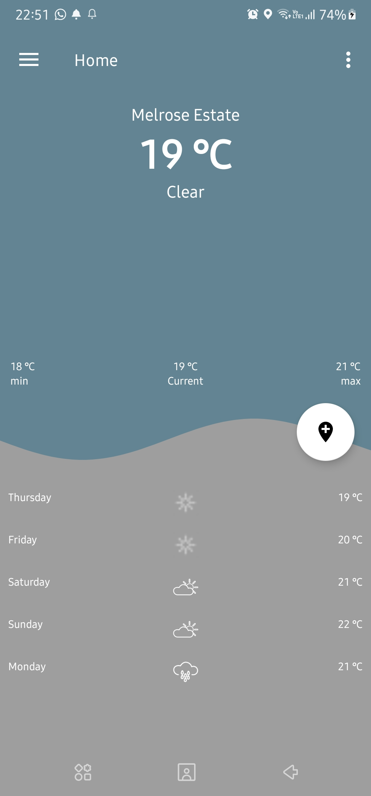
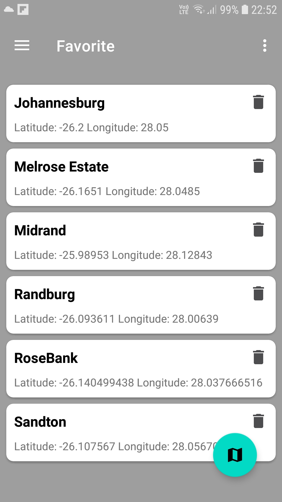
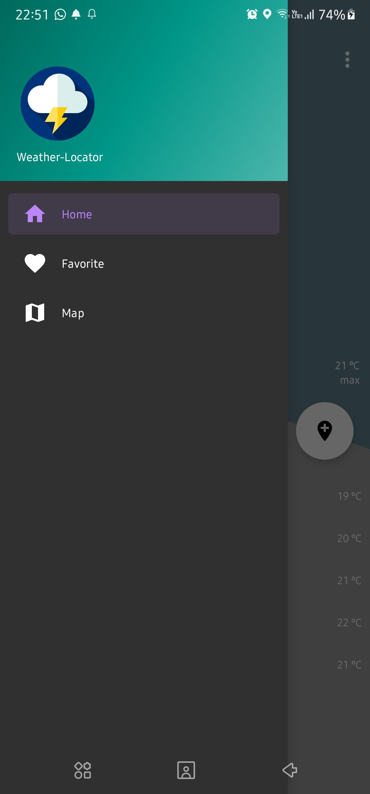
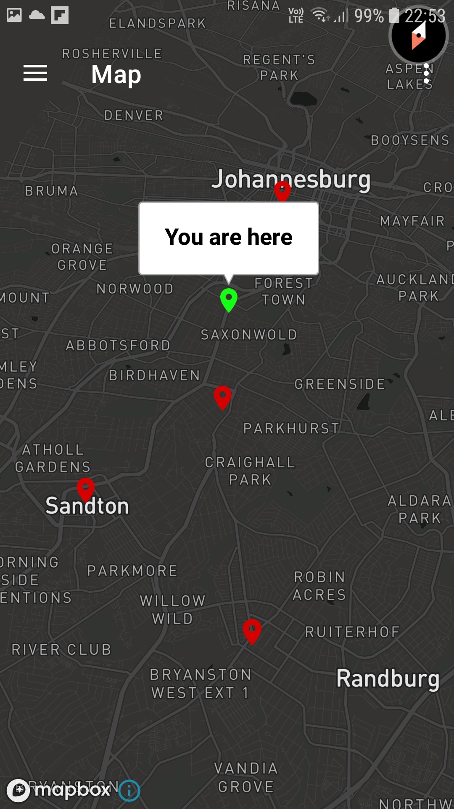

# WeatherLocator
A simple weather App that provide weather and forecast based on the user's location and allow user to save their current location

    Technology used {
        - Kotlin
        - Coroutine Flow
        - Hilt
        - Room
        - MVVM
        - LiveData
        - Mockito for Unit testing.
        - Travis for CI
    }

  Screenshots below

